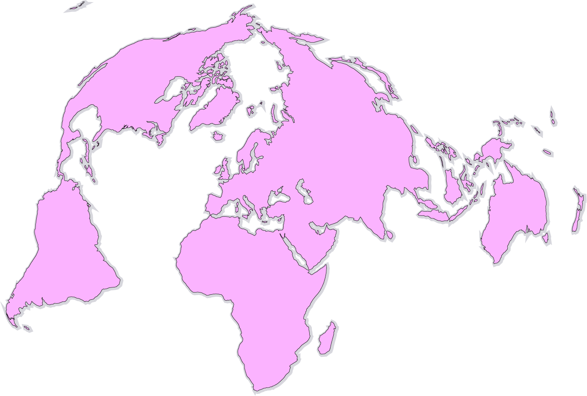

# Fonds de cartes

## Sources

### Éléments géographiques

- Frontières : [Natural Earth, corrigée Visionscarto](https://github.com/Fil/ne_110m_fixes)

- Graticule, Équateur, tropiques, ligne de changement d’heure : [Natural Earth via http://geojson.xyz/](http://geojson.xyz/)

### Projections

- [Visionscarto inspirée de Bertin 1953](http://visionscarto.net/)
- [Bottomley](http://visionscarto.net/la-projection-bottomley)
- [Larrivée](http://bl.ocks.org/mbostock/3719042)
- [Robinson](http://bl.ocks.org/mbostock/3710566)
- [Winkel-Tripel](http://bl.ocks.org/mbostock/3682676)
- [Gall-Peters](http://bl.ocks.org/mbostock/3946824)

(La plupart des projections sont faites avec une rotation de 10,2° de manière à faire passer la ligne de césure dans le détroit de Bering.)

### Logiciels

- [D3.js](http://d3js.org)
- [topojson](https://github.com/mbostock/topojson)
- [D3 extended projections](https://github.com/d3/d3-geo-projection)
- [PhantomJS](http://phantomjs.org/)
- [svgo](https://github.com/svg/svgo)
- [optipng](http://optipng.sourceforge.net/)

